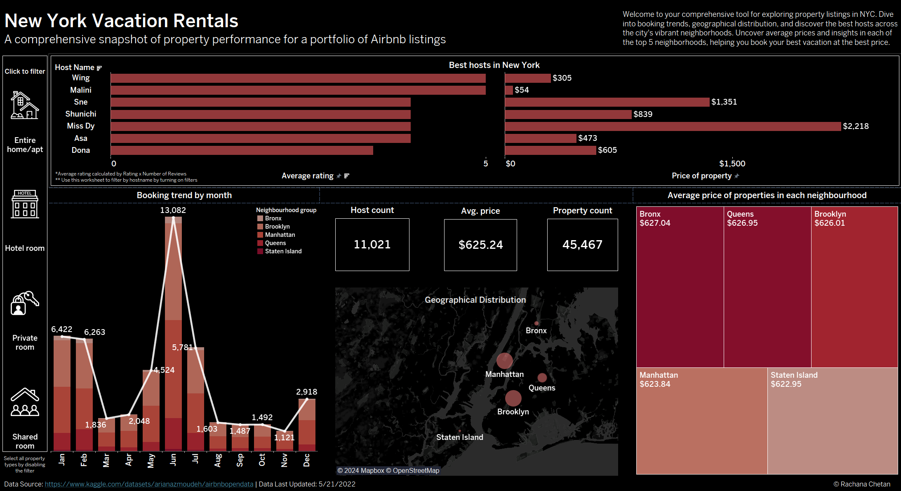

# Airbnb Dashboard with New York Vacation Rentals
### Synopsis: This dashboard is designed to help tourists book their best vacation for the best price. Featuring Airbnb listings and powered by Tableau, it offers visual insights into booking trends, property details, and host performance so that the user is able to make a decision of choosing the best vacation rental unit for the best price at an ideal location.

### List of tools used:
Google Colab: Python 3, Runtime - GPU for data cleaning
Tableau

### About Dataset
Since 2008, guests and hosts have used Airbnb to travel in a more unique, personalized way. As part of the Airbnb Inside initiative, this dataset describes the listing activity of homestays in New York City
The following Airbnb activity is included in this New York dataset:
Listings, including full descriptions and average review score Reviews, including unique id for each reviewer and detailed comments Calendar, including listing id and the price and availability for that day.

### Data cleaning:
As seen in the [attachment](/Airbnb_Open_Data_Data_cleaning_Rachana.ipynb), the steps followed for data cleaning are as follows: 
Step 1: Removing duplicates
Step 2: Rename columns to remove spaces for ease of use
Step 3: Convert certain object types to float values and remove $ and other unwanted characters
Step 4: Remove unwanted columns

The cleaned data is saved as a .csv file [here](/Airbnb_Cleaned.csv) and used as the data source for the dashboard built on Tableau.

### Resultant tableau Dashboard 

  

Attached above is a screenshot of the built dashboard. You can download the Tableau [workbook](/AirbnbDashboard_Final.twbx) or find it hosted on Tableau Public: https://public.tableau.com/app/profile/rachana.chetan/viz/AirbnbDashboard_Final/Dashboard1

